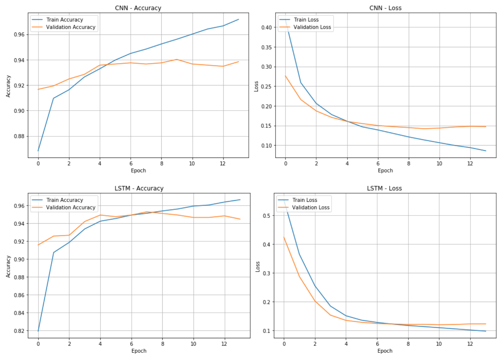
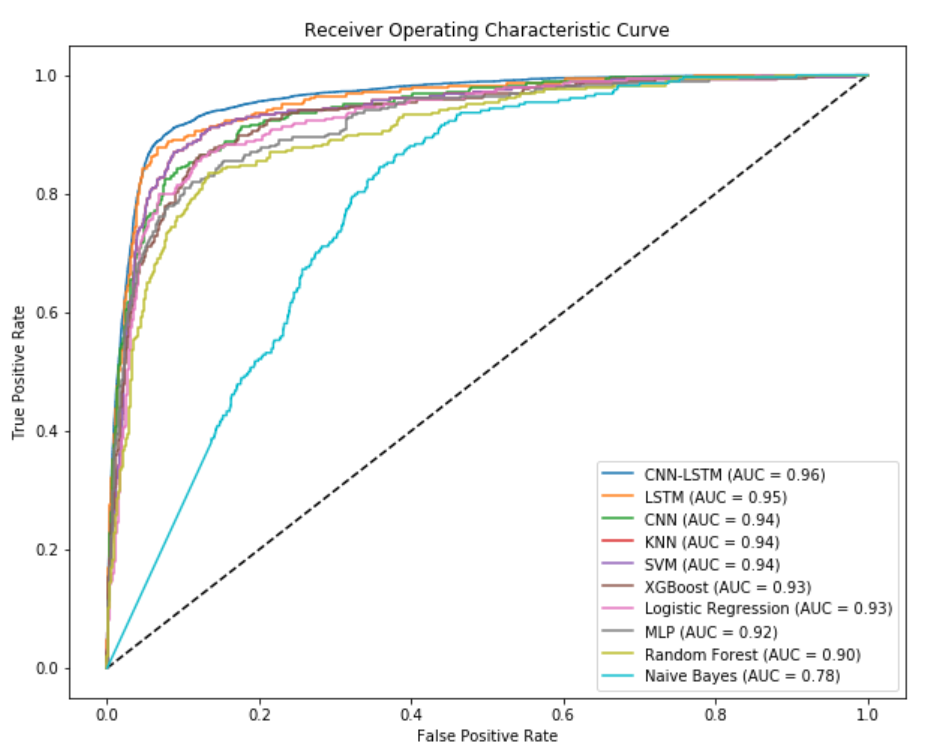
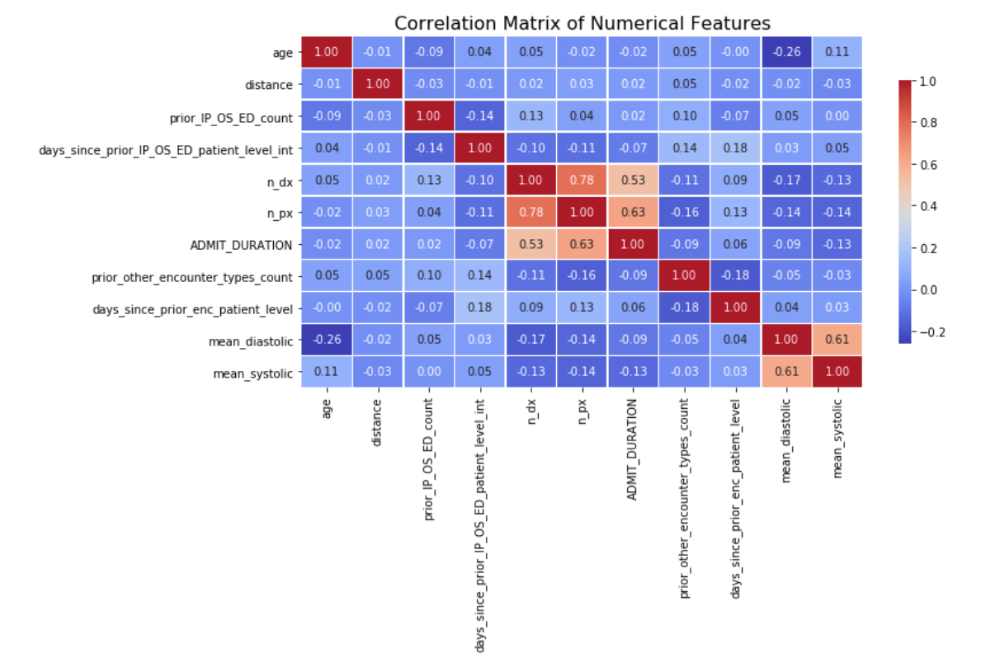
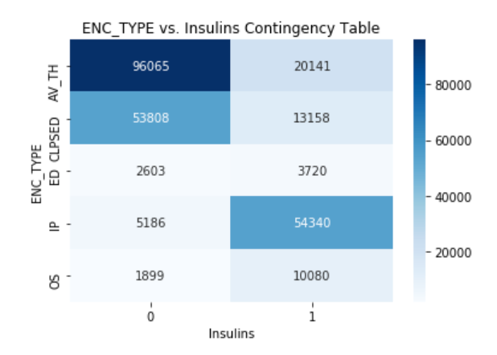
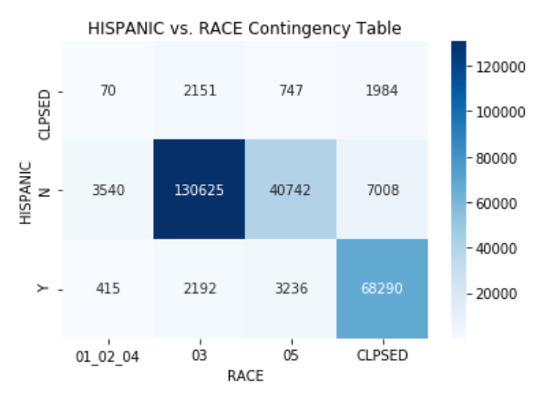

# Predicting 30-Day Hospital Readmission in Diabetes Patients with a CNN-LSTM Model

A hybrid Deep Learning approach for risk prediction using Electronic Health Records (EHR).

**Author**: Dassie Galapo | Healthcare AI | Deep Learning | Predictive Modeling

## Medium Article 

Check out my medium article here:  
[Predicting 30-Day Hospital Readmissions with a CNN-LSTM Model: How Deep Learning Can Help Improve Patient Outcomes](https://medium.com/@hadassah.galapo/predicting-30-day-hospital-readmissions-with-a-cnn-lstm-model-how-deep-learning-can-help-improve-199b60926ecf)

## Project Summary

This project addresses the challenge of predicting 30-day hospital readmissions for diabetes patients—a high-risk population—by developing a hybrid CNN-LSTM model that captures both spatial and temporal patterns from Electronic Health Records.
> **Disclaimer**: The dataset used is HIPAA-compliant and cannot be shared. This project is for academic and demonstration purposes only.

- Dataset: 261,000 HIPAA-compliant inpatient encounters
- Goal: Forecast 30-day readmission from past patient visits
- Method: Deep Learning with CNN-LSTM (1D conv + LSTM layers)
- Result: **AUROC = 0.96**, outperforming all baseline models

## Repository Structure

| Folder / File | Description |
|---------------|-------------|
| `notebooks/`  | Preprocessing and training notebooks |
| `docs/`       | Final paper and data field overview |
| `images/`     | Visualizations and analysis graphs |
| `workflow.md` | Step-by-step technical process |

## Tech Stack

- Python 3.10
- TensorFlow + Keras
- scikit-learn
- pandas, NumPy, Matplotlib, Seaborn
- Jupyter Notebooks

## Model Training & Results

### CNN vs LSTM Loss/Accuracy

### ROC Curve Comparison (AUROC)

---

## 🔎 Exploratory Analysis

### Correlation Matrix of Numeric Features

### Encounter Type vs Insulin Use

### Race vs Hispanic Status

| Model        | AUROC | F1 Score |
|--------------|--------|----------|
| CNN-LSTM     | **0.96** | **0.94** |
| LSTM         | 0.95   | 0.94     |
| CNN          | 0.94   | 0.93     |
| Logistic Reg | 0.86   | 0.92     |
| XGBoost      | 0.88   | 0.91     |

